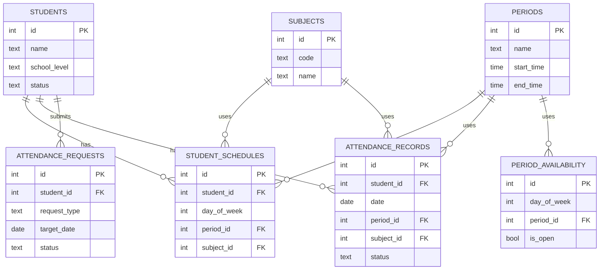

# RED 生徒管理・出欠管理システム データベース設計

対象テーブル: コママスタ・曜日別コマ受付可否・科目マスタ・生徒・生徒別定期スケジュール・申請・出欠記録
DB: Supabase (PostgreSQL)
DDL本体: [`schema.sql`](./schema.sql) を参照(このドキュメントは設計意図の説明に専念します)

## テーブル一覧

| テーブル名 | 役割 |
|---|---|
| `periods` | コママスタ(時間割の枠) |
| `period_availability` | 曜日別のコマ受付可否(管理者が開閉を設定) |
| `subjects` | 科目マスタ(M/E/Q/J/D) |
| `students` | 生徒台帳 |
| `student_schedules` | 生徒ごとの定期スケジュール(曜日×コマ×科目) |
| `attendance_requests` | 欠席・振替の申請 |
| `attendance_records` | 出欠の実績記録(その日・そのコマの実際の状態) |

## ER図

## 各テーブルの設計ポイント

### periods(コママスタ)
時間割の「枠」を管理するマスタ。①〜⑧の8コマ(15:00〜20:55、各40分)を`schema.sql`に初期データとして投入済み。

| カラム | 内容 |
|---|---|
| name | 表示名(①〜⑧) |
| start_time / end_time | 開始・終了時刻 |
| sort_order | 表示順 |

### period_availability(曜日別のコマ受付可否)
「その曜日・そのコマを受け付けるか」を管理するマスタ。生徒個別のスケジュール(`student_schedules`)とは別に、教室全体としての営業枠を管理者が設定できるようにするためのテーブル。

7曜日×8コマ=56行を全て明示的に投入し(行の有無ではなく`is_open`で判定)、初期値は以下の通り。

| 曜日 | 受付コマ |
|---|---|
| 日 | なし(終日クローズ) |
| 月〜金 | ④〜⑧ |
| 土 | ①〜⑥ |

管理者はこの表の`is_open`を更新することで、曜日ごとの受付コマを自由に変更できる。

### subjects(科目マスタ)
現状の文字列管理(M/E/Q/J/D)をマスタ化したもの。

| カラム | 内容 |
|---|---|
| code | 短縮コード(M/E/Q/J/D) |
| name | 表示名(数学/英語/QUREO/Japanese/DOJO) |
| sort_order | 表示順 |

5科目分の初期データを`schema.sql`に含めています。

### students(生徒)
生徒台帳。`status`で在籍中/退会済みを区別し、一覧から退会者を自然に除外できるようにしています。

| カラム | 内容 |
|---|---|
| name / name_kana | 氏名・フリガナ |
| school_level / school_name / grade | 小中高区分・学校名・学年 |
| status | active(在籍中) / inactive(退会済み) |
| login_id | 生徒本人ログイン用ID(管理者が発行、任意の文字列) |
| auth_user_id | Supabase Authのユーザー(UUID)との紐付け。生徒ログインの実体はSupabase Authが持つ |

### 生徒本人ログインの仕組み
生徒は基本的にメールアドレスを持たない前提のため、Supabase Authは`<login_id>@students.internal`のような実在しないダミーメールで登録し、パスワードのみ管理者が発行・共有する。ログイン画面では生徒は`login_id`とパスワードだけを入力し、アプリ内部でダミーメールに変換してSupabase Authへ渡す。
ログイン後は`auth.uid()`を使ったRLSポリシー(下記)により、その生徒自身の行しか読めない。

### student_schedules(生徒別定期スケジュール)
「曜日・コマ・科目」の定期スケジュール。**月次のバッチ生成は行わず、画面表示のたびにこのテーブルから当日分を計算します。** 同一生徒・同一曜日・同一コマの重複登録はDB制約で防止しています。

**80分授業(小学5年生以上)の扱い**: 同じ曜日・同じ科目で2行(連続コマ)を登録することで表現する。例: 火曜80分授業なら(火・③・算数)と(火・④・算数)の2行。
有効な連続コマは(①②)(③④)(⑤⑥)(⑦⑧)の組み合わせのみで、奇数コマ単独(①③⑤⑦のみ)の登録は80分単位にならないためNG。この検証はDBスキーマではなくNext.js側の業務ロジック層で行う想定(**管理者操作の場合は警告表示のみで登録自体は許可**、という例外があるため)。

### attendance_requests(欠席・振替申請)
生徒・保護者からの欠席/振替申請を管理。承認フローは`status`(pending/approved/rejected)で管理します。

### attendance_records(出欠記録)
その日・そのコマの実際の記録。**レコードが存在しない組み合わせは「定期スケジュール通り・未確定」を意味します。** 欠席・振替・科目変更など個別の変更があった場合のみ、この表に1行作成・更新します。

| status | 意味 |
|---|---|
| present | 出席 |
| absent | 欠席 |
| late | 遅刻 |
| makeup | 振替(この回自体が振替授業) |

## 出欠データの表示ロジック(重要)

1. 管理画面で日付を選択すると、その日の曜日をもとに`student_schedules`を検索し、コマごとの「本来来るはずの生徒一覧」を算出する(バッチ生成なし)。
2. 同じ日付・コマ・生徒の組み合わせで`attendance_records`にレコードがあれば、そちらを優先して表示する(ステータス・科目の上書き)。
3. 定期スケジュールにない生徒をその日そのコマに追加したい場合(振替出席の受け入れなど)は、`attendance_records`に新規行を作成する。

## 確認・検討事項

1. `attendance_requests`が承認された際、`attendance_records`を自動更新するか、手動で確認・入力するか未確定です。
2. `students`に他に必要な項目(保護者連絡先など)があれば追加します(学校名は追加済み)。
3. 80分授業の連続コマ検証(上記)はDBの制約ではなくアプリ側で実装する前提です。DB側での制約化(トリガー等)が必要であれば別途相談してください。

## 決定済み事項

- **RLS**: 管理画面(Next.jsサーバー側)はservice role keyを使うためRLSの影響を受けない。生徒本人ログイン(Supabase Auth・anon key経由)には、自分の`students`/`student_schedules`/`attendance_records`/`attendance_requests`行のみ参照でき、`attendance_requests`は自分の分のみ新規作成できるポリシーを設定済み(`schema.sql`末尾参照)。anonロール(未ログイン)には一切のアクセス権を与えていない。
